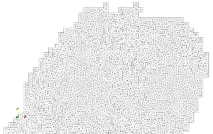

# Mesh

## Introduction

With Elmer/Ice we usually have to prescribe boundary conditions at the edges of the ice-sheet.

To create the initial Elmer/Ice mesh we first extract the ice-sheet extent from the GRISLI input variable **tacheg**.

We use [Elmer/Ice meshing tools](https://github.com/ElmerCSC/elmerfem/tree/devel/elmerice/Meshers/GIS) to make the mesh
using [gmsh](https://gmsh.info/).


## Example

Here we mesh the Barents Kara ice sheet from a GRISLI simulation. The Barents Kara Ice-sheet corresponds to **tacheg=1**.


The procedure is implemented in the bash script [MakeMesh.sh](MakeMesh.sh)


0. source meshing scripts

```bash
export SRC_DIR=..
source ${SRC_DIR}/src/MeshFunctions.sh
```

1. Step 1 : Extract contour from GRISLI  

```bash
## GRISLI input data file
GRISLI="${SRC_DIR}/DATA/LGM-IPSL-abs_euras20-pourElmer.nc"
## tacheg values conrreponding to the domain
MaskVal=1

ExtractPolygon
```

This step creates:  
- contour.shp: a polygon shapefile of the ice sheet.

Remark: Eventually if the polygon has holes they have to be removed; this can be done in QGIS with the toolbox.

2. Step 2 : Convert polygon to gmsh .geo file  


```bash
## elmerice python script to create the .geo files
Contour2geo=${ELMER_SRC}/elmerice/Meshers/GIS/Contour2geo.py
## mesh resolution
resolution=10.0e3

ShpToGeo
```

This step creates:  
- mesh.geo: the gmsh .geo file. This file can be edited to change the mesh resolution 


3. Step 3 : make gmsh mesh and convert to Elmer format  


```bash
GeoToElmer
```

This step creates:  
- gmsh mesh file: mesh.gmsh  
- Elmer serial mesh directory: *mesh/*    
- Paraview vtu file of the mesh: mesh.vtu  

Eventually the mesh can be converted to polygons and imported in e.g. QGIS, see doc [here](https://github.com/ElmerCSC/elmerfem/tree/devel/elmerice/Meshers/GIS).



## Requirements 


